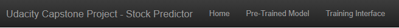
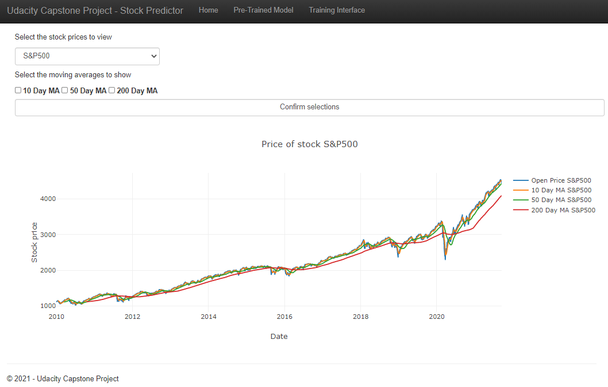
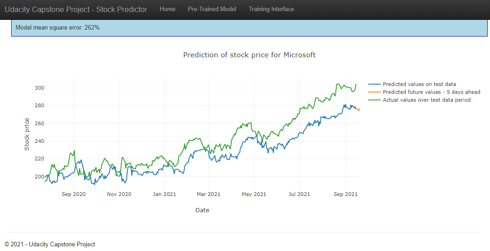
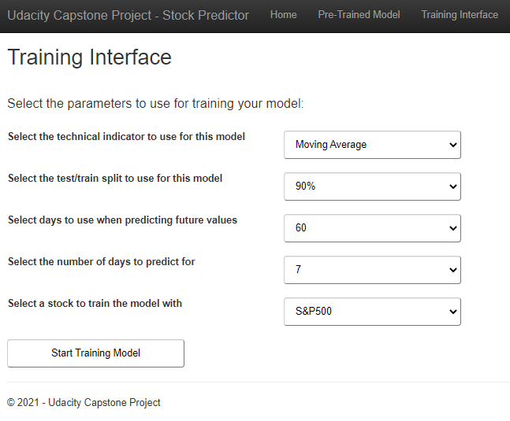

# UdacityCapstoneProject_StockPredictor

## Table of Contents
1. [Description](#description)
2. [Using the application](#getting_started)
	1. [Requirements to run project](#dependencies)
	2. [Installation](#installation)
	3. [Executing Program](#execution)
	4. [Using the web application](#using)
	5. [Additional Information](#material)
3. [Acknowledgements](#acknowledgements)
4. [Authors](#authors)


<a name="descripton"></a>
## Description

This is a capstone project for the Udacity Nano degree in data science. The project scope is to create a web application that is able to analyse stock prices, stock price technical indicators as well as predict the future prices a selected stock. 

The main functionality of web application include:
1. Query an API to retrieve stock price data
2. Store stock price data in an SQLite database
3. Pre-process the stock price data for visualization using plotly
4. Pre-process the stock price data in order to train a machine learning model
5. Build and train a machine learning model with input parameters and publish the results to the web application
6. View the results of an already trained machine learning model for a specific stock in the web application

<a name="getting_started"></a>
## Using the application

<a name="dependencies"></a>
### Requirements to run project
* Python 3.7+
* Date manipulation: datetime
* Data manipulation: Pandas, Numpy
* Machine Learning Libraries: Keras, Tensor Flow, SciKit learn
* Database management: SQLalchemy
* Web App and Data Visualization: Flask, Plotly
* Stock data API: yfinance 0.1.63

<a name="installation"></a>
### Installation
To clone the git repository:
```
git clone https://github.com/dirklambrechts/UdacityCapstoneProject_StockPredictor
```
<a name="execution"></a>
### Executing Program:
1. Run the following command to start a local server on your machine:
    `python runserver.py`

2. Go to http://localhost:5555/ to view and use the web application

<a name="using"></a>
### Using the web application:
1. The web application consists of three main pages: Home, Pre-Trained Model and Training Interface. 

2. The home page is the stock price analysis page that enables a user to see and analyse the price of a stock along with three different technical indicators (moving averages) to select from. Select the stock you would like to analyse and select the technical indicators you would like to see for the stock selected. 

3. The Pre-Trained Model page allows a user to view the results of a pre-trained model. The pre-trained model makes use of Keras to build a long short-term memory model that takes as inputs the open, close, adjusted close and 50 day moving average to predict the adjusted closing price. The pre-trained model page shows the results of the test data as well as the future values predicted 5 days into the future. 

4. The training interface page enables a user to select parameters that you would like to use to train a model. By selecting the start training model button a training cycle commences and produces a page to show the results of the model over the training period as well as the predicted future stock price for the selected period.


<a name="material"></a>
### Additional Information
Please take note that training a model may take some time, please be patient when using the training interface page. 

<a name="acknowledgements"></a>
## Acknowledgements
[Udacity](https://www.udacity.com/) for the Capstone project idea.

<a name="authors"></a>
## Authors

* [Dirk Lambrechts](https://github.com/dirklambrechts)
